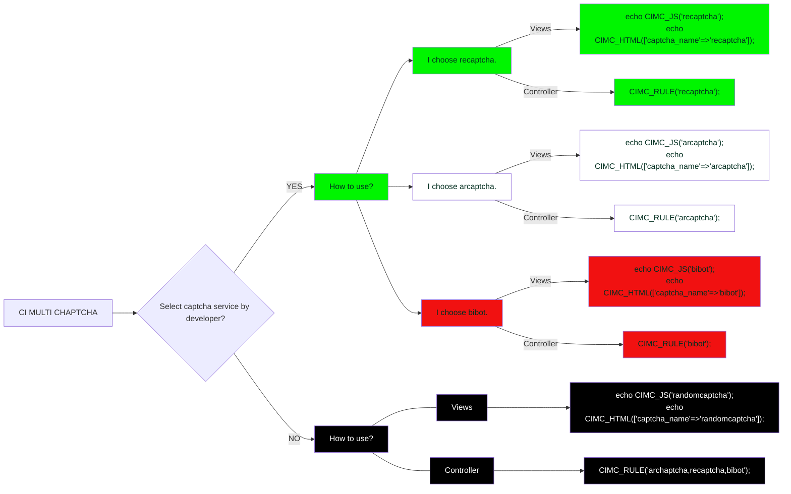

# Streamline User and Group Management with Databricks Notebook

## Intro

`What is the best practice for manage identities in Databricks?` is one of the
most common questions a new Databricsk customer will ask the Databricks
implementation team. The answer is always `It depends` as it depends on the
size of your organization, the number of users, the number of groups ...etc.
If you keep pushing for a more specific answer, most likely the answer is
`Using Databricks UI` for small organizations and
`Using Terraform or SCIM provisioning` for large organizations.

Unfortunately, none of the above answers is satisfying. The first one is not
scalable and the second one is not flexible due to the nature of our workflow.
I want to write this article to share my experience on this topic.

## The Problem

In order to understand the solution, we need to understand the problem first.

Why not `Using Databricks UI` should be very self-explanatory. It is not
scalable and have a lot of room for human error. It makes sense for using UI
for eloxporation and testing but not for production.

Why not `Using Terraform or SCIM provisioning`? In my opinion, Terraform is for
 infrastructure as code not for identity management. It is possible to use it
 for the this purpose but it will end up with many data resource objects which
 make the infrastructure code hard to understand and maintain.

`SCIM provisioning` is a better option than Terraform as it is designed for
identity management which is also the solution I plan to use in the beginning.
However, I did not go with this option because `Communication Overhead`. In our
 workflow, the group creation and its permission is done by Terraform. The
 access request is done by ServiceNow. If we want to use SCIM provisioning to
 handle the user group management, we need to create a new workflow to
 communicate among all services. It is doable but it is not worth the effort.
 In addition, the tool is owned by different teams which make the communication
  even harder.

## The Solution

After a few weeks of research, I found a better way to manage identities in
Databricks. In a nutshell, the solution is to use Databricks Notebook to manage
 the user and group. The notebook will read the YAML file which contains the
 user and group information and calling Databricks API to add or remove the
 user from the group. The benefit of this solution is that

- ensure the uptime due to no dependency on other tool
- high flexibility and scalability
- reset the permission to the desired state

### Requirements

Nothing is required per se. However, I do have some pro tips for you if you
consider adopting this solution.

- a repository to store the notebook and YAML file.
- a secret management tool to store the senstive token.
- a CI/CD tool to trigger the notebook when the YAML file is updated.
- a service principal to run the notebook.

